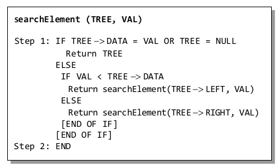
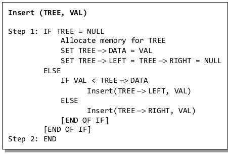
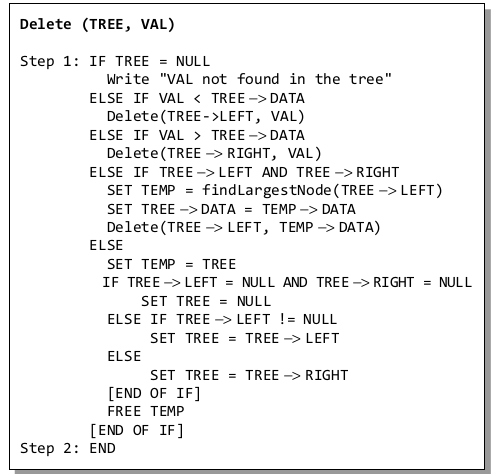
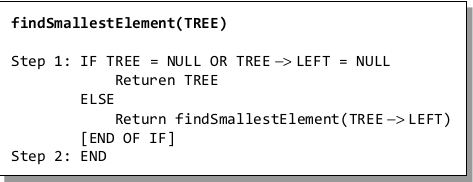
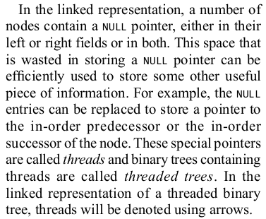
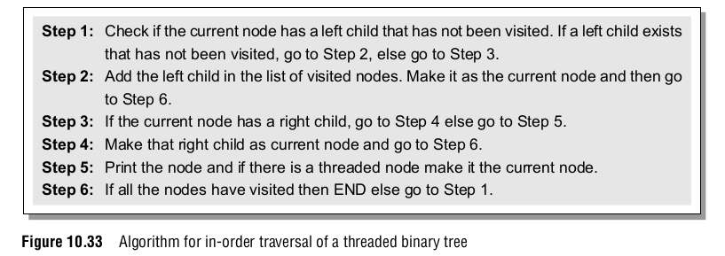

```

```

# Search Trees

## Binary Search Trees

###### Data Structures and Algorithms in Java {Y2014, E6, Wiley}


------

### Searching

###### Data Structures and Algorithms in Java {Y2014, E6, Wiley}


###### Data Structures Using C {Y2018, E2}



------

### Insertion

###### Data Structures and Algorithms in Java {Y2014, E6, Wiley}


###### Data Structures Using C {Y2018, E2}




------

### Deletion

###### Data Structures and Algorithms in Java {Y2014, E6, Wiley}

- predecessor =>  the entry having the greatest key that is strictly less than that of position p.  located in the right-most internal position of the left subtree of position p


------


------

###### Data Structures Using C {Y2018, E2}



### Finding the Smallest Node in a Binary Search Tree 

###### Data Structures Using C {Y2018, E2}




### Finding the Largest Node in a Binary Search Tree

###### Data Structures Using C {Y2018, E2}


## THREADED BINARY TREEs

###### Data Structures Using C {Y2018, E2}

* It enables linear traversal of elements in the tree. 
* Linear traversal eliminates the use of stacks which in turn consume a lot of memory space and computer time. 
* It enables to find the parent of a given element without explicit use of parent pointers. 
* Since nodes contain pointers to in-order predecessor and successor, the threaded tree enables forward and backward traversal of the nodes as given by in-order fashion.








## Tries

## Balanced Tree Implementations of Sets

## Sets with the MERGE and FIND Operations

## An ADT with MERGE and SPLIT


# Directed Graphs

## Representations for Directed Graphs

## The Single-Source Shortest Paths Problem

## The All-Pairs Shortest Path Problem

## Traversals of Directed Graphs

## Directed Acyclic Graphs

## Strong Components


# Undirected Graphs

## Minimum-Cost Spanning Trees

## Traversals

## Articulation Points and Biconnected Components

## Graph Matching


# Sorting

## The Internal Sorting Model

## Some Simple Sorting Schemes

## Quicksort

## Heapsort

## Bin Sorting

## A Lower Bound for Sorting by Comparisons

## Order Statistics


# Algorithm Analysis Techniques

## Efficiency of Algorithms

## Analysis of Recursive Programs

## Solving Recurrence Equations

## A General Solution for a Large Class of Recurrences


# Algorithm Design Techniques

## Divide-and-Conquer Algorithms

## Dynamic Programming

## Greedy Algorithms

## Backtracking

## Local Search Algorithms


# Data Structures and Algorithms for External Storage

## A Model of External Computation

## External Sorting

## Storing Information in Files

## External Search Trees


# Memory Management

## The Issues in Memory Management

## Managing Equal-Sized Blocks

## Garbage Collection Algorithms for Equal-Sized Blocks

## Storage Allocation for Objects with Mixed Sizes

## Buddy Systems

## Storage Compaction


# IMPL


***

# Tree


```c#
public interface ITreeNode<out T>
{        
    T Item { get; }
    bool IsLeaf { get; }
    ITreeNode<T> Parent { get; }
    IEnumerable<ITreeNode<T>> Children { get; }
    int Degree { get; }        
}
```

```c#
 public enum TraversalOrder
 {
	PreOrder,
 	InOrder,
 	PostOrder,
 	BreadthFirst
 }
```

```c#
public interface ITree<out T, N> : IEnumerable<T>
        where N : ITreeNode<T>
{
	N Root { get; }
	IEnumerable<N> Nodes { get; }
    IEnumerable<N> Leaves { get; }
    bool IsEmpty { get; }
    IEnumerable<N> Enumerate(TraversalOrder order);
    int GetCount();        
	IEnumerable<N> GetPath(N node);
}
```


## BinaryTree


```c#
public interface IBinaryTreeNode<out T> : ITreeNode<T>
{
    IBinaryTreeNode<T> LeftChild { get; }
    IBinaryTreeNode<T> RightChild { get; }
}

```

```c#
public interface IBinaryTree<out TItem, out TNode> : ITree<TItem, TNode> 
    where TNode : IBinaryTreeNode<TItem>
{
	bool IsProper();
    bool IsComplete();
}
```

## SearchTree

``` C#
public interface ISearchTree<T, K, N>
    where N: 
{
    Comparison<K> KeyCompartor {get;}
    Func<T, K> KeySelector {get;}        
    int Count {get;}
    IEnumerable<K> Keys {get;}
    bool Contains(K key);
    K MinKey();
    K MaxKey();
    int GetRank(K key);
    IEnumerable<K> GetKeys(K loKey, K hiKey);
    N Ceiling(K Key);
    N Floor(K key);
    N Locate(K key);
    N LocateRank(int rank);        
}
```


## BinarySearchTree

```c#
public interface IBinarySearchTree<T, K>: IBinaryTree<T, IBinaryTreeNode<T>>, ISearchTree<T, K, IBinaryTreeNode<T>>
{    
    IBinaryTreeNode<T> Ceiling(K Key);
    IBinaryTreeNode<T> Floor(K key);
    IBinaryTreeNode<T> Locate(K key);
    IBinaryTreeNode<T> LocateRank(int rank);
}
```

```c#
public class BinarySearchTree<T, K>: IBinaryTree<T, K>
{
 	public Comparison<K> KeyCompartor {get; private set;}
    public Func<T, K> KeySelector {get; private set;}   
    public int Count {get; private set;}    
    public IBinaryTreeNode<T> Add(T item, bool uniq = false);
    public void Remove(IBinaryTreeNode<T> node);
    public void ReplaceItem(IBinaryTreeNode<T> node, T item);
}
```

