# Binary Search Trees

###### Data Structures and Algorithms in Java {Y2014, E6, Wiley}

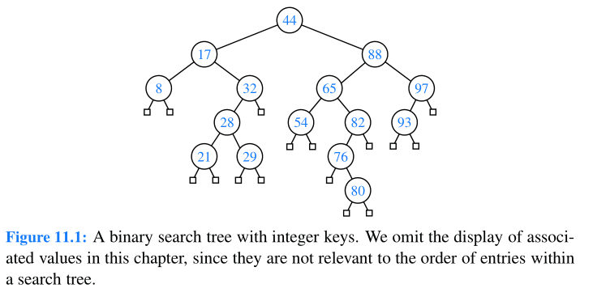


## Searching

###### Data Structures and Algorithms in Java {Y2014, E6, Wiley}

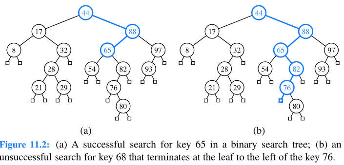 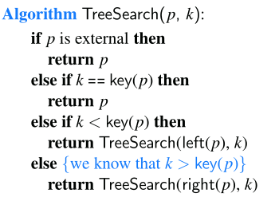


###### Data Structures Using C {Y2018, E2}

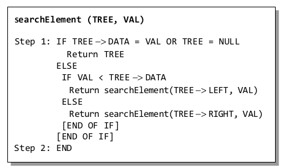

###### Algorithms {Y2011, E4}


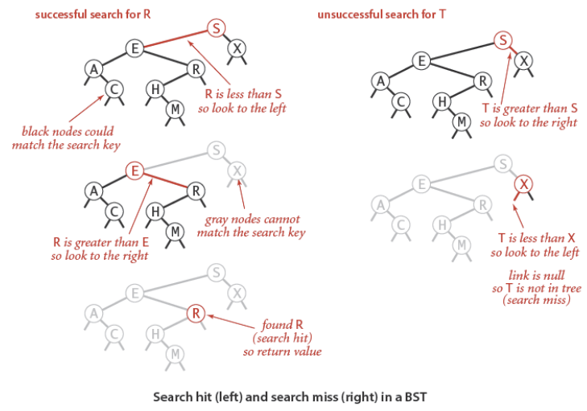

```java
// Return value associated with key in the subtree rooted at x;
// return null if key not present in subtree rooted at x.
Value get(Node x, Key key)
{
    if (x ==null) return null;
    int cmp = key.compareTo(x.key);
    if (cmp < 0) return get(x.left, key);
    else if (cmp > 0) return get(x.right, key);
    else return x.val;
}
```


###### Essential Algorithms - A Practical Approach to Computer Algorithms Using Python and C# {Y2019, E2}

```pseudocode
// Find a node with a given target value.

BinaryNode: FindNode(Key: target)
	// If we've found the target value, return this node.
	If (target == Value) Then Return <this node>

	// See if the desired value is in the left or right subtree.
	If (target < Value) Then
		// Search the left subtree.
		If (LeftChild == null) Then Return null
		Return LeftChild.FindNode(target)
	Else
		// Search the right subtree.
		If (RightChild == null) Then Return null
		Return RightChild.FindNode(target)
	End If
End FindNode
```


## Insertion

###### Data Structures and Algorithms in Java {Y2014, E6, Wiley}


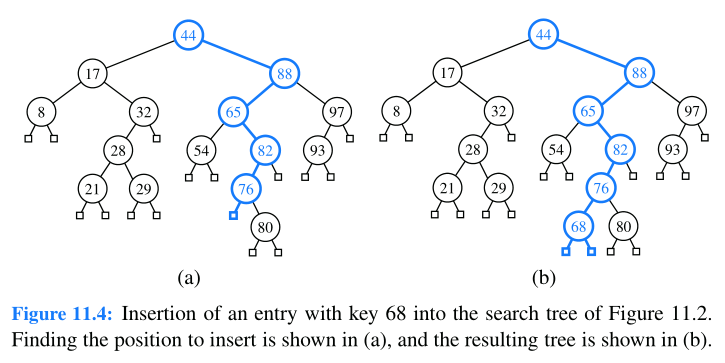 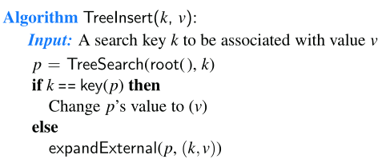


###### Data Structures Using C {Y2018, E2}

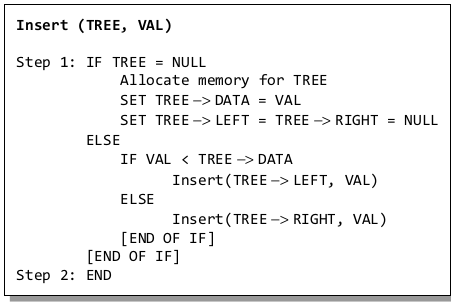


###### Algorithms {Y2011, E4}

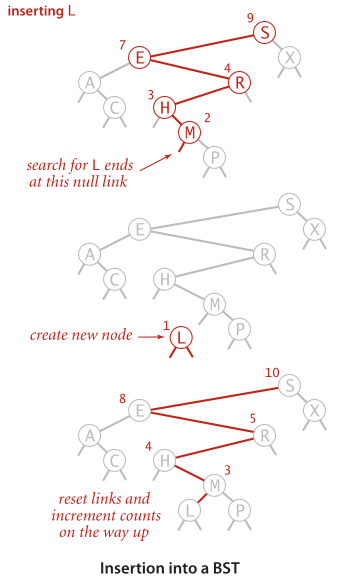

```java
private Node put(Node x, Key key, Value val)
{
	//Change key's value to val if key in subtree rooted at x.
	//Otherwise, add new node to subtree associating key with val.
    if (x ==null) return new Node(key, val, 1);
    int cmp = key.compareTo(x.key);
    if (cmp < 0) x.left put(x.left, key, val);
    else if (cmp > 0) x.right = put(x.right, key, val);
    else x.val =val;
    x.N = size(x.left) + size(x.right) + 1;
    return x;
}
```


###### Essential Algorithms - A Practical Approach to Computer Algorithms Using Python and C# {Y2019, E2}

``` pseudocode
// Add a node to this node's sorted subtree.
AddNode(Data: new_value)
    // See if this value is smaller than ours.
    If (new_value < Value) Then
    	// The new value is smaller. Add it to the left subtree.
    	If (LeftChild == null) LeftChild = New BinaryNode(new_value)
    	Else LeftChild.AddNode(new_value)
    Else
        // The new value is not smaller. Add it to the right subtree.
        If (RightChild == null) RightChild = New BinaryNode(new_value)
        Else RightChild.AddNode(new_value)
    End If
End AddNode
```


## Deletion

###### Data Structures and Algorithms in Java {Y2014, E6, Wiley}

predecessor =>  the entry having the greatest key that is strictly less than that of position p.  located in the right-most internal position of the left subtree of position p


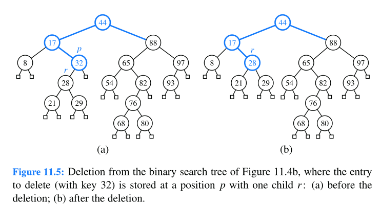

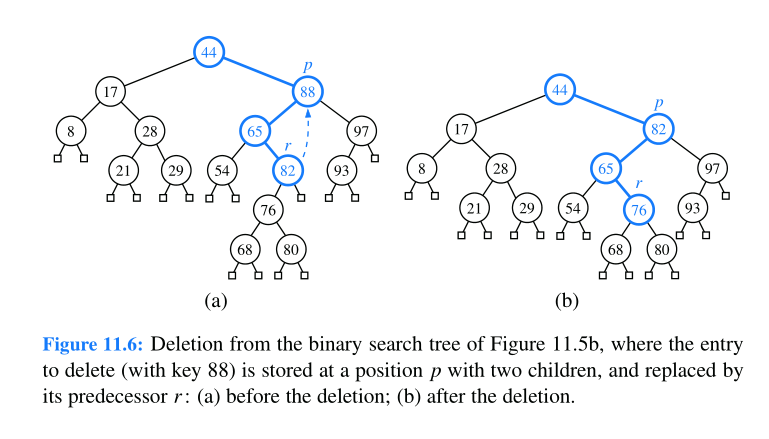

###### Data Structures Using C {Y2018, E2}


## Finding the Smallest Node in a Binary Search Tree

###### Data Structures Using C {Y2018, E2}

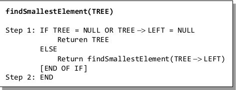


## Finding the Largest Node in a Binary Search Tree

###### Data Structures Using C {Y2018, E2}

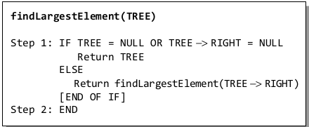


## Lowest Common Ancestors

###### Essential Algorithms - A Practical Approach to Computer Algorithms Using Python and C# {Y2019, E2}


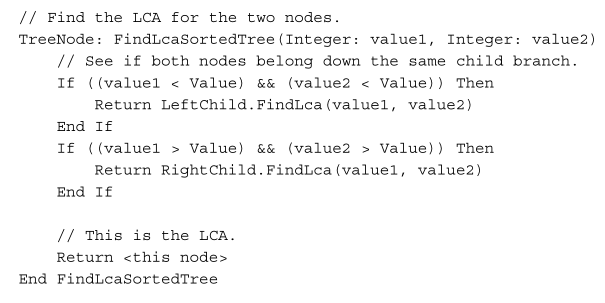


## Floor

###### Algorithms {Y2011, E4}

Floor(k) :arrow_right:  the largest key less than or equal to k.

* If a given key k is less than the key at the root , then the floor of k must be in the left subtree

* If k is greater than the key at the root and if there is a key smaller than or equal to k in the right subtree then the floor of k is  in the right subtree

* if not (or if k is equal to the key at the root), then the key at the root is the floor of k.

  


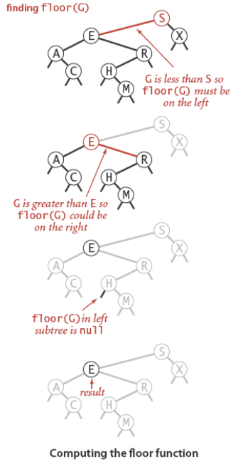

###### Data Structures and Algorithms in Java {Y2014, E6, Wiley}

``` java
/∗∗ Returns the entry with greatest key less than or equal to given key (if any). ∗/
public Entry<K,V> floorEntry(K key) throws IllegalArgumentException 
{
	checkKey(key); // may throw IllegalArgumentException
    Position<Entry<K,V>> p = treeSearch(root(), key);
	if (isInternal(p)) return p.getElement(); // exact match
    while (!isRoot(p)) 
    {
        if (p == right(parent(p)))
            return parent(p).getElement(); // parent has next lesser key
        else
            p = parent(p);
    }
	return null
}
```


## Ceiling

Ceiling(k) :arrow_right:  the smaller key greater than or equal to k.

* If a given key k is greater than the key at the root , then the ceiling of k must be in the right subtree

* If k is less than the key at the root and if there is a key greater than or equal to k in the left subtree then the ceiling of k is  in the left subtree

* if not (or if k is equal to the key at the root), then the key at the root is the ceiling of k.


## GetRange

GetRange :arrow_right: returns to a client all the nodes in a specified range

###### Algorithms {Y2011, E4}

``` java
public Iterable<Key> keys(Key lo , Key hi)
{
    Queue<Key> queue = new Queue<Key>();
	keys(root, queue, lo, hi);
	return queue;
}

private void keys(Node x, Queue<Key> queue, Key lo, Key hi)
{
    // skip the recursive calls for subtrees that cannot contain keys in the range
    if (x ==null ) return;
	int cmplo = lo.compareTo(x.key);
	int cmphi = hi.compareTo(x.key);
	//ignore x.left if lo > x.key
	if (cmplo < 0) keys(x.left, queue, lo , hi);    // lo < x.key 
	if (cmplo <= 0 && cmphi >= 0) queue.enqueue(x.key); //x.key in [lo, hi]
    //ignore x.right if hi < x.key
	if (cmphi > 0) keys(x.right, queue, lo , hi);    //hi < x.key 
}
```


## Min

* If the left link of the root is null, the smallest key in a is the key at the root; 
* if the left link is not null, the smallest key in the BST is the smallest key in the subtree rooted at the node referenced by the left link

###### Algorithms {Y2011, E4}

```Java
private Node min(Node x)
{
    if (x. left == null) return x;
	return min(x.left)
}

```


###### Data Structures Using C {Y2018, E2}

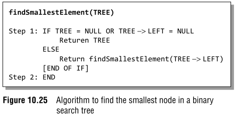


## Max

###### Data Structures Using C {Y2018, E2}

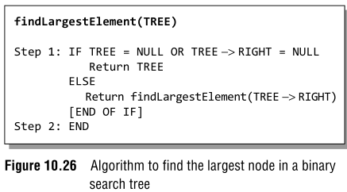

## GetNode

GetNode(n) :arrow_right: the key such that precisely n other keys in the BST are smaller


###### Algorithms {Y2011, E4}

* If the number of keys **t** in the left subtree is larger than **n**, we look (recursively) for the
  key of rank **n** in the left subtree; 
* if **t** is equal to **n**, we return the key at the root; 
* if **t** is smaller thank, we look (recursively) for the key of rank **n - t - 1** in the right subtree.


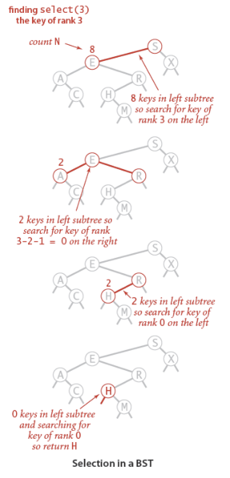

``` java
Node select(Node x, int k)
{
	//Return Node containing key of rank k.
    if (x ==null ) return null;
    int t = size(x.left);    
    if (t > k) return select(x. left , k);
    else if (t < k) return select(x.right, k -t-1 );
    else return x;
}
```


## Successor

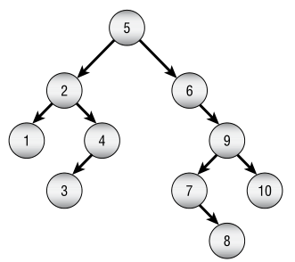

``` pseudocode
Successor(node)
	if node.RightChild == null
		p = node.Parent		
		while p != null and p.RightChild == node
			node == p
			p = p.Parent
		end while		
		node = p;
	else
		node = node.RightChild
		
		while node.LeftChild != null
			node = node.LeftChild
	end if
	
	return node
END	
		
```


## Impl


```mermaid
classDiagram
class ITreeNode~T~
<<interface>> ITreeNode

class ITree~T,~N
<<interface>> ITree

class BasicTree_Node~T~
class BasicTree~T~

ITreeNode <|-- BasicTree_Node
ITree <|.. BasicTree
%%--------------

class IBinaryTreeNode~T~ {
<<interface>>
}
class BinaryTree_Node~T~
class IBinaryTree~T~{
<<interface>>
}
class BinaryTree~T~

ITreeNode <|-- IBinaryTreeNode
ITree <|--IBinaryTree
IBinaryTreeNode <|..BinaryTree_Node
IBinaryTree <|..BinaryTree
%%-------------------------------------
class ISearchTree~T, K, N~{
<<interface>>
}

ITree <|-- ISearchTree
%%---------------------

class IBinarySearchTree~T, K~{
<<interface>>
}
class BinarySearchTree~T, K~

IBinaryTree <|-- IBinarySearchTree
ISearchTree <|-- IBinarySearchTree
IBinarySearchTree <|.. BinarySearchTree
```

---

```C#
public interface ITree<out T, N> : IEnumerable<T>
        where N : ITreeNode<T>
{
	N Root { get; }
	IEnumerable<N> Nodes { get; }
    IEnumerable<N> Leaves { get; }
    bool IsEmpty { get; }
    IEnumerable<N> Enumerate(TraversalOrder order);
    int GetCount();        
	IEnumerable<N> GetPath(N node);
}
```


```C#
public interface IBinaryTree<out T, N> : ITree<T, N> 
    where N : IBinaryTreeNode<T>
{}
```


```C#
public interface ISearchTree<T, K, N>: ITree<T, N>
    where N: ITreeNode<T>
{
    Comparison<K> KeyCompare {get;}
    Func<T, K> KeySelect {get;}        
    int Count {get;}
    IEnumerable<K> Keys {get;}
    bool ContainsKey(K key);
    N Min();
    N Max();
        //perform badly
    //int GetIndex(K key); 
	//N GetNode(int ndx);  
    N Ceiling(K Key);
    N Floor(K key);
    N Locate(K key);       
    IEnumerable<N> GetRange(K loKey, K hiKey);
    N FirstCommonAcestor(N node0, N node1);
}
```


```c#
public interface IBinarySearchTree<T, K>: IBinaryTree<T, IBinaryTreeNode<T>>, ISearchTree<T, K, IBinaryTreeNode<T>>
{}  
```


```c#
public class BinarySearchTree<T, K>: IBinarySearchTree<T, K>
{
    public BinarySearchTree(Func<T, k> selector  null, Comparison<T> comp = null);
    
	public Comparison<K> KeyCompare {get;}
    public Func<T, K> KeySelect {get;}        
	public IBinaryTreeNode<T> Root { get; }	
    
    public int Count {get;}
    int IBinaryTree<T, IBinaryTreeNode<T>>.GetCount(); 
    
    public bool IsEmpty { get; }    
    public IEnumerable<K> Keys {get;}    
	public IEnumerable<IBinaryTreeNode<T>> Nodes { get; }
    public IEnumerable<IBinaryTreeNode<T>> Leaves { get; }

    public IEnumerable<IBinaryTreeNode<T>> Enumerate(TraversalOrder order);           
	public IEnumerable<IBinaryTreeNode<T>> GetPath(N node);
	public IEnumerable<IBinaryTreeNode<T>> GetRange(K loKey, K hiKey);
    /*	pre:
    	loKey <= hiKey
    */

    public bool ContainsKey(K key);
    public IBinaryTreeNode<T> Locate(K key);    
    
    public IBinaryTreeNode<T> Min();
    /*	pre:
    	!IsEmpty
    */
    
    public IBinaryTreeNode<T> Max();    
    /*	pre:
    	!IsEmpty
    */
    
    public IBinaryTreeNode<T> Ceiling(K Key);
    public IBinaryTreeNode<T> Floor(K key);

    public IBinaryTreeNode<T> FirstCommonAcestor(IBinaryTreeNode<T> n0, IBinaryTreeNode<T> n1);
    /*	pre:
    	no != null
    	Contains(no)
    	n1 != null
    	Contains(n1)
    */

    public IBinaryTreeNode<T> Add(T item);
    /*	pre:
    	!ContainsKey(KeySelector(item))
    */
    
    public bool TryAdd(T item, out IBinaryTreeNode<T> node );
    public void Remove(IBinaryTreeNode<T> node);
    /*	pre:
    	Trees.Contains(this, node)
    */
    public void ReplaceItem(IBinaryTreeNode<T> node, T item);
    /* pre:
    	node != null
    	KeySelector(node.Item) == KeySelector(item)
    */
}
```