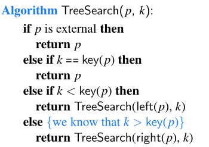
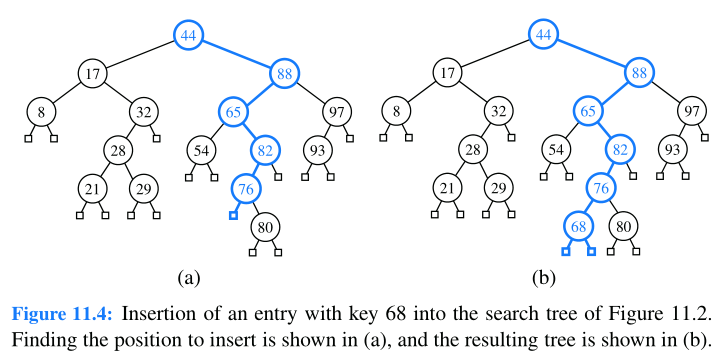
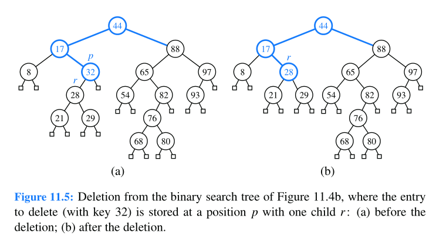
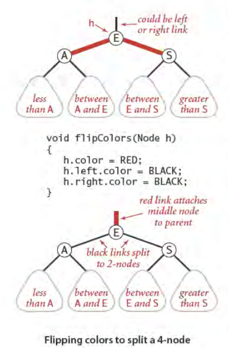

---

typora-copy-images-to: img
---

# Binary Search Trees


------

### Searching



------

### Insertion



------

### Deletion

- predecessor =>  the entry having the greatest key that is strictly less than that of position p.  located in the right-most internal position of the left subtree of position p



------


------

### Impl


```c#
interface IBST<T, K>: IBinaryTree<T, IBinaryTreeNode<T>>
{
    Comparison<K> KeyComparison {get;}
    Func<T, K> KeySelector {get;}
    IBinaryTreeNode<T> Root {get;}
    int Count {get;}
    K MinKey();
    K MaxKey();
    IBinaryTreeNode<T> Floor(K key);
    IBinaryTreeNode<T> Ceiling(K key);
    int GetRank(K Key);
    IBinaryTreeNode<T> LocateRank(int rank);
    IBinaryTreeNode<T> Locate(K Key);    
}
```


```c#
class BST<T, K>: IBST<T, K>
{
    IBinaryTreeNode<T> Add(T item, bool uniq = false);
    void Remove(IBinaryTreeNode<T> node);
    void ReplaceItem(IBinaryTreeNode<T> node, T item);
    K GetKey(T item);
    int Compare(K key0, K key1);
    IBinaryTreeNode<T> LocateKey(K Key);
}
```


# Balanced Search Trees


------

​	

------

# AVL Trees

- Height-Balance Property: For every internal position p of T , the heights of the
  children of p differ by at most 1.

### Insertion


------

We restore the balance of the nodes in the binary search tree T by a simple
“search-and-repair” strategy. In particular: 

let **z** be the first position we encounter in going up from p toward the root of T such that z is unbalanced

Also, let **y** denote the child of **z** with greater height (and note that **y** must be an
ancestor of p). 

Finally, let **x** be the child of **y** with greater height (there cannot be
a tie and position **x** must also be an ancestor of p, possibly p itself ). 


We rebalance the subtree rooted at **z** by calling the *trinode restructuring* method, **restructure(x)**.

------


------

### Deletion

we use trinode restructuring to restore balance in the tree T .

- let **z** be the first unbalanced position encountered going up from p toward the root of T 
- let **y** be that child of **z** with greater height (y will not be an ancestor of p). Furthermore, let **x** be the child of y defined as follows: 
  - if one of the children of **y** is taller than the other, let x be the taller child of **y**; 
  - else (both children of **y** have the same height), let **x** be the child of **y** on the same side as **y** (that is, if **y** is the left child of **z**, let **x** be the left child of **y**, else let **x** be the right child of **y**.


------

# 2-3 search trees

- A perfectly balanced 2-3 search tree is one whose null links are all the same distance
  from the root.


------


------


------


------

```c#
interface IMultiNodeBSTNode<T>
{
    T Item {get;} 
    IMultiNodeTreeNode<T> Parent {get;}
    IMultiNodeTreeNode<T> GetChild(int ndx);    
}
```


```c#
class MultiNodeBSTNode<T>: IMultiNodeTreeNode<T>
{
    IMultiNodeBSTNode<T>[] m_children;
 
    Comparaison<T> KeyComparison {get;}
    Func<T, K> KeySelector {get;}
    T Item {get; set;} 
    IEnumerable<IMultiNodeBSTNode<T>> Children {get;}
    IMultiNodeBSTNode<T> Parent {get; set;}
    IMultiNodeBSTNode<T> GetChild(int ndx);
    IMultiNodeBSTNode<T> AddChild(IMultiNodeBSTNode<T> node);
    IMultiNodeBSTNode<T> InsertChild(IMultiNodeBSTNode<T> node, int ndx);
    IMultiNodeBSTNode<T> RemoveChild(int ndx),
}
```


```c#
interface IMultiNodeBST<T, K>
{
    int MaxDegree {get;}
    IMultiNodeBSTNode<T> Root {get;}
    int Count {get;}
    IEnumerable<K> Keys {get;}
    IMultiNodeBSTNode<T> Locate(K key);
}
```


```c#
class MultiNodeBST<T, K>: IMultiNodeBST<T, K>
{
    public void Add(T item);
    public void Remove(IMultiNodeBSTNode<T> node);
    public void ReplaceItem(IMultiNodeBSTNode<T> node, T item);
}
```


# Red-black Trees

- The root is black.
- The children of a red node are black.
- All external nodes have the same black depth, defined as the number of proper ancestors that are black.


------

given a red-black tree, we can construct a corresponding (2, 4) tree by merging every red node w into its parent, storing the entry from w at its parent, and with the children of w becoming ordered children of the parent.


------

we can transform any (2, 4) tree into a corresponding red-black tree by coloring each node w black and then performing the following transformations:

- If w is a 2-node, then keep the (black) children of w as is. 
- If w is a 3-node, then create a new red node y, give w’s last two (black) children to y, and make the first child of w and y be the two children of w.
- If w is a 4-node, then create two new red nodes y and z, give w’s first two (black) children to y, give w’s last two (black) children to z, and make y and z be the two children of w.


a red node always has a black parent in this construction.


------

### Insertion


------


------


------


------


------



------

- If the right child is red and the left child is black, rotate left.
- If both the left child and its left child are red, rotate right.
- If both children are red, flip colors.

### Deletion


------


------


```java
//ex: 3.3.39 Algorithms {Y2011, E4}
private Node moveRedLeft(Node h)
{ 
    // Assuming that h is red and both h.left and h.left.left
	// are black, make h.left or one of its children red.
    flipColors(h);
    if (isRed(h.right.left))
    {
	    h.right = rotateRight(h.right);
    	h = rotateLeft(h);
    }
    return h;
}

public void deleteMin()
{
    if (!isRed(root.left) && !isRed(root.right))
	    root.color = RED;
    root = deleteMin(root);
    if (!isEmpty()) root.color = BLACK;
}
private Node deleteMin(Node h)
{
if (h.left == null)
return null;
if (!isRed(h.left) && !isRed(h.left.left))
h = moveRedLeft(h);
h.left = deleteMin(h.left);
return balance(h);
}

//This code assumes a balance() method that consists of the line of code
//if (isRed(h.right)) h = rotateLeft(h);
```

```java
// ex: 3.3.40 Algorithms {Y2011, E4}
private Node moveRedRight(Node h)    
{ 
    // Assuming that h is red and both h.right and h.right.left
	// are black, make h.right or one of its children red.
    flipColors(h)
    if (!isRed(h.left.left))
    	h = rotateRight(h);
    return h;
}
public void deleteMax()
{
    if (!isRed(root.left) && !isRed(root.right))
	    root.color = RED;
    root = deleteMax(root);
    if (!isEmpty()) root.color = BLACK;
}
private Node deleteMax(Node h)
{
	if (isRed(h.left))
		h = rotateRight(h);
	if (h.right == null)
		return null;
	if (!isRed(h.right) && !isRed(h.right.left))
		h = moveRedRight(h);
	h.right = deleteMax(h.right);
	return balance(h);
}
```

```java
//ex: 3.3.41 Algorithms {Y2011, E4}
public void delete(Key key)
{
    if (!isRed(root.left) && !isRed(root.right))
	    root.color = RED;
    root = delete(root, key);
    if (!isEmpty()) root.color = BLACK;
}
private Node delete(Node h, Key key)
{
    if (key.compareTo(h.key) < 0)
    {
        if (!isRed(h.left) && !isRed(h.left.left))
        h = moveRedLeft(h);
        h.left = delete(h.left, key);
    }
    else
    {
        if (isRed(h.left))
	        h = rotateRight(h);
        if (key.compareTo(h.key) == 0 && (h.right == null))
    	    return null;
        if (!isRed(h.right) && !isRed(h.right.left))
        	h = moveRedRight(h);
        if (key.compareTo(h.key) == 0)
        {
            h.val = get(h.right, min(h.right).key);
            h.key = min(h.right).key;
            h.right = deleteMin(h.right);
        }
        else h.right = delete(h.right, key);
    }
    return balance(h);
}
```


### Impl

```c#
interface IRBNode<T> : IBinaryTree<T> 
{
	T Item {get;}
	IRBNode<T> Parent {get;}
	IRBNode<T> LeftChild {get;}
	IRBNode<T> RightChild {get;} 
	bool IsRedChild {get;}
}
```

```c#
private class RBNode<T> : IRBNode<T>
{    	
    public T Item {get; set;}
	public IRBNode<T> Parent {get; set;}
	public IRBNode<T> LeftChild {get; set;}
	public IRBNode<T> RightChild {get; set;}
	bool IsRedChild {get; set;}
}
```


```c#
interface IRBTree<T, K>: IEnumerable<T>
{
    IRBNode<T> Root {get;}
    int Count {get;}
    IEnumerable<K> Keys {get;}
    IRBNode<T> Locate(K key);
}
```


# Splay Trees

a splay operation causes more frequently accessed elements to remain nearer to the root.

### Splaying

- We perform a zig-zig or a zig-zag when x has a grandparent
- we perform a zig when x has a parent but not a grandparent.
- A splaying step consists of repeating these restructurings at x until x becomes the root of T


------


------


------


------

When to Splay:

- When searching for key k, if k is found at position p, we splay p, else we splay the parent of the leaf position at which the search terminates unsuccessfully
- When inserting key k, we splay the newly created internal node where k gets inserted.
- When deleting a key k, we splay the position p that is the parent of the removed node; recall that by the removal algorithm for binary search trees, the removed node may be that originally containing k, or a descendant node with a replacement key


------

# (2,4) Trees

- multiway search tree => which internal nodes may have more than two children.
- An n -entry multiway search tree has n + 1 external nodes.
- For each entry (k, v) stored at a node in the subtree of w rooted at c i , i = 1, . . . , d, we have that
  k ~i−1~ ≤ k ≤ k ~i~ .


------

### Insertion


------


------


------

### Deletion


------


------


